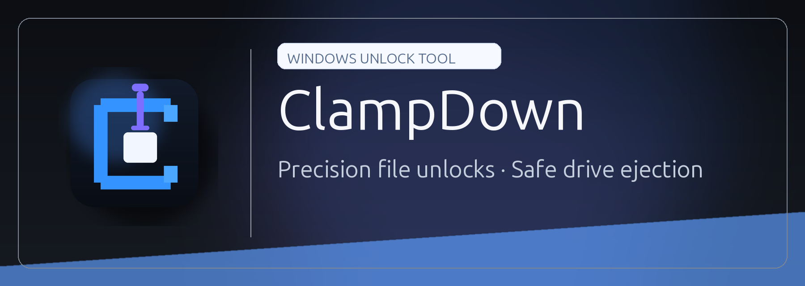

<p align="center">
  
</p>

<h1 align="center">ClampDown</h1>

<p align="center">
  <strong>The ultimate Windows utility for surgical file unlocking and safe drive management.</strong>
</p>

---

<p align="center">
  <strong>⚠️ DISCLOSURE: EXPERIMENTAL SOFTWARE ⚠️</strong><br>
  <em>ClampDown is currently in an experimental phase. While designed with a "safe-first" philosophy using documented Windows APIs, forceful operations can cause data loss or system instability. User caution is advised, and maintaining backups of critical data is strongly recommended.</em>
</p>

---

<h2 align="center">Welcome to ClampDown</h2>

If you've ever been frustrated by a Windows prompt claiming a file is "open in another program" or a USB drive that "cannot be ejected," ClampDown is your solution.

ClampDown provides a unified interface—available as a Desktop UI, a Command Line Interface, and a System Tray app—to identify exactly which processes are locking your files and to resolve those locks with precision and safety.

<h2 align="center">Quick Setup</h2>

Get up and running in seconds:

1. **Download**: Get the latest release from the [Releases](https://github.com/soficis/ClampDown/releases) page.
2. **Extract**: Move `ClampDown.exe` to a permanent folder (e.g., `C:\Tools\ClampDown`).
3. **Launch**: Double-click `ClampDown.exe` for the Graphical Interface, or run `ClampDown.exe --tray` to keep it ready in your system tray.

---

<h2 align="center">Example Use Cases</h2>

- **"Is this file being used?"**: Instantly see which applications (like Chrome, Word, or an IDE) have handles open to a specific file or folder.
- **"I need to delete this NOW"**: Safely request applications to close, or use the "Force Kill" option (with built-in safety blocks) to free the file for immediate deletion.
- **USB Ejection Failures**: Identify which process is preventing a safe eject and stop it without needing to log off or restart.
- **Rename on Reboot**: If a file is locked by a system process that cannot be stopped, schedule a rename or move for the next system startup.

---

<h2 align="center">Core Features</h2>

- **Restart Manager Integration**: Uses native Windows APIs to detect file lockers accurately.
- **Safe-to-Forceful Workflow**: Options ranging from "Ask App to Close" to "Force Termination."
- **Drive Management**: Dedicated tab for removable drives with helper actions like "Close Explorer" and "Stop Drive Apps."
- **Automation Ready**: A comprehensive CLI with JSON output support for scripting and automation.
- **Explorer Integration**: Optional right-click context menu for "Analyze" and "Unlock & Delete."
- **Safety Blocklist**: Prevents accidental termination of critical system processes.

---

<h2 align="center">Usage Guide</h2>

### Graphical User Interface

The desktop application provides a tabbed interface for all major functions:

- **Files**: Analyze paths, close lockers, and perform unlock-and-act operations (Copy, Move, Rename, Delete).
- **Drives**: Manage removable media and resolve ejection blockers.
- **Log**: View a history of actions taken in the current session.
- **Settings**: Configure theme, elevation (Admin mode), and startup behavior.

### Command Line Interface

Run `ClampDown.exe --help` for a full list of commands.

```powershell
# Identify lockers
clampdown analyze "C:\important_file.txt"

# Force delete a file (sends to Recycle Bin by default)
clampdown unlock-delete "C:\locked_folder" --recursive

# Safe eject a drive
clampdown eject "E:\"
```

### System Tray & Context Menu

- **Tray Mode**: Runs silently in the background (`--tray`) for quick drive ejection via right-click.
- **Context Menu**: Register via the included PowerShell scripts to add "Analyze locks" and "Unlock & Delete" directly to Windows Explorer.

---

<h2 align="center">Developer Information</h2>

### Architecture

ClampDown consists of a thin UI/CLI layer built upon `ClampDown.Core` and `ClampDown.Win32`, leveraging P/Invoke for direct Windows API access and WMI for drive management.

### Building

Requires .NET 9 SDK.

```powershell
dotnet build ClampDown.sln -c Release
```

---

<p align="center">
  Released under the <strong>GNU General Public License v3.0</strong>.
</p>
